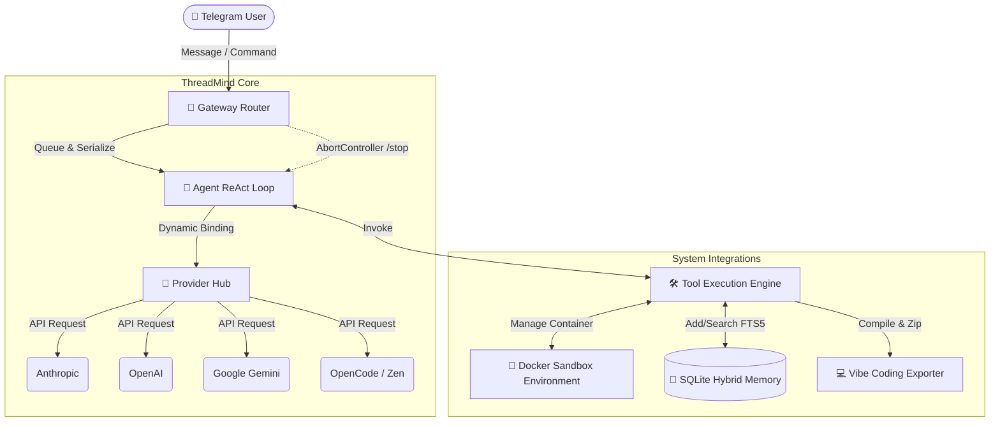
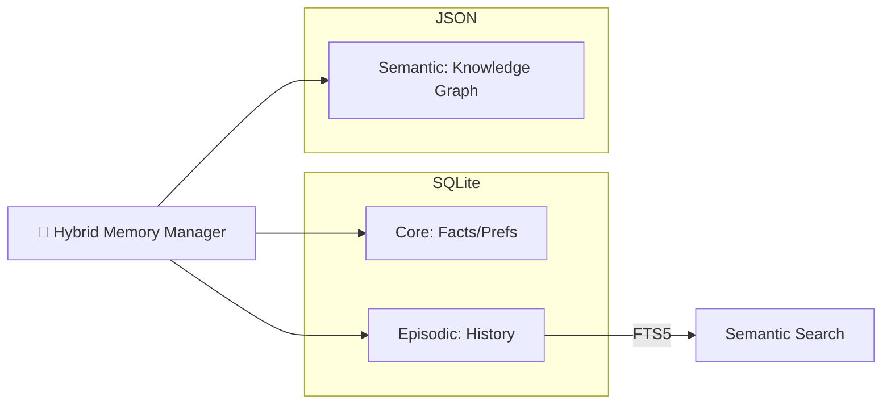

# 🧠 ThreadMind: The Autonomous Intelligence Framework

ThreadMind is a high-performance, modular AI agent framework built with TypeScript. Engineered for extreme reliability, deep technical integration, and autonomous project lifecycle management.

---

## 🏗️ Architecture

ThreadMind operates on a **Gateway-Loop** architecture, ensuring asynchronous safety and real-time streaming capabilities.

### System Overview


### Memory Hierarchy


---

## 🚀 Key Features

- **💻 Vibe Coding**: Generates complete, contextually aware projects, packages them into ZIP files, and delivers them instantly.
- **🐳 Docker Sandbox**: Isolated Debian-based execution environment with auto-recovery and configurable RAM/CPU limits to prevent OOM.
- **🧠 Hybrid Memory**: Context-aware persistent storage using SQLite FTS5 and graph-based relationships with intelligent forgetting curves.
- **🔌 Provider Swapping**: Hot-swap between top-tier LLMs without restarting the system.
- **🔍 Researcher Swarm**: Autonomous sub-agents that synthesize web information into high-density insights.

---

## 💻 System Requirements

- **OS**: Windows 10/11 (PowerShell), macOS, or Linux (Ubuntu/Debian recommended).
- **Node.js**: v18.0.0 or higher.
- **Docker**: Desktop (Windows/Mac) or Engine (Linux) — *Required for Sandbox features*.
- **RAM**: Minimum 4GB (8GB+ recommended for heavy compilation in Docker).
- **Disk**: 1GB minimum for SQLite and Docker images.

---

## 🛠️ Installation Guide

### 🪟 Windows Setup (PowerShell)
1. **Clone the Repo**:
   ```powershell
   git clone https://github.com/your-username/ThreadMind.git
   cd ThreadMind
   ```
2. **Install Dependencies**:
   ```powershell
   npm install
   ```
3. **Environment Config**:
   ```powershell
   copy .env.local.example .env
   # Open .env and fill in your API keys
   ```
4. **Launch**:
   ```powershell
   npm start
   ```

### 🐧 Linux / macOS Setup (Bash)
1. **Clone the Repo**:
   ```bash
   git clone https://github.com/your-username/ThreadMind.git
   cd ThreadMind
   ```
2. **Install Dependencies**:
   ```bash
   npm install
   ```
3. **Environment Config**:
   ```bash
   cp .env.local.example .env
   # Edit .env with your favorite editor
   ```
4. **Launch**:
   ```bash
   npm start
   ```

---

## 🛡️ Special Abilities & Constraints

### Special Abilities
- **Isolated Execution**: Every line of code the agent writes is tested for you in a locked-down container.
- **Bulletproof UX**: Uses a custom HTML serializer to bypass communication platform parsing limits.
- **Global Abort**: Stop any reasoning or tool process instantly with `/stop`.

### Performance Constraints
- **Resource Limits**: Configurable in `src/tools/docker.ts` to manage CPU/RAM footprints.
- **Token Ceiling**: Automatically compresses history after 40 messages to maintain speed.
- **Latency**: Deep research swarms may take 10-30 seconds depending on web scraping complexity.

---

## 📦 Project Structure

```text
├── src/
│   ├── core/           # Gateway, Providers, Middleware
│   ├── features/       # Advanced Logic (Immune System, Causal Graphs)
│   ├── tools/          # System Interfaces (Docker, FS, Web)
│   ├── memory/         # Persistence (SQLite, JSON)
│   └── channels/       # Adapters (Telegram, Web)
├── data/               # Persistent data (Ignored by Git)
└── extension/          # Chrome Extension source
```

---

*ThreadMind: Secure. Reliable. Autonomous. Built for the future of engineering.*
